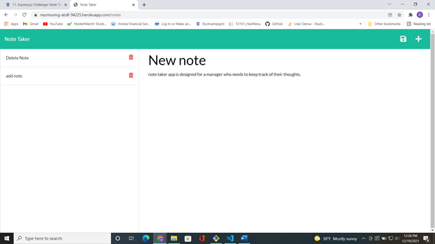

# Note-Taker200 
  ## Description 

  This project is a an application that was designed to give users the capability to write notes that help them keep track of their tasks and thoughts. The user can create notes and delete them with ease and have them stored in a servers database so written notes are always available when the user accesses the site.

  ## Table of Contents
  In here you will find links to each section of this projects readme
  - [Installation](#installation)
  - [Usage](#usage)
  - [Tests](#tests)
  - [Questions](#questions)

  ## *Installation*

  This app is delpoyed on a live server and doesnt need to be downladed to be used. You can download the repo files from the internet by navigating to my linked github page, and going to the note-taker200 repo.

  ## Usage 

  Go to application at the linked website. Then click on an empty field and type in the note title, and note text, then click the little file save icon that should appear at the top of the page.

  ## Screenshots
  

  

  

  Link to live website: [Note-Taker200](https://murmuring-atoll-94225.herokuapp.com/)

  ## Tests

  You could use jest to test the app method functions through node, depending on if you downloaded the files. You would have to npm install jest to save it as a dependancy first. Otherwise just use the app on the live server normally and check for bugs.

  ## Questions 

  - My GitHub username: Demsley1
  - Link to my GitHub page and repositories: [Github Link](https://github.com/Demsley1)
  _Link to my main work email if anyone should ever choose to contact me regarding work, or with helpful suggestions on how to improve this project and 
  also fix or update any major issues with project_
  - For All inquires email me at: emsley3684@gmail.com
